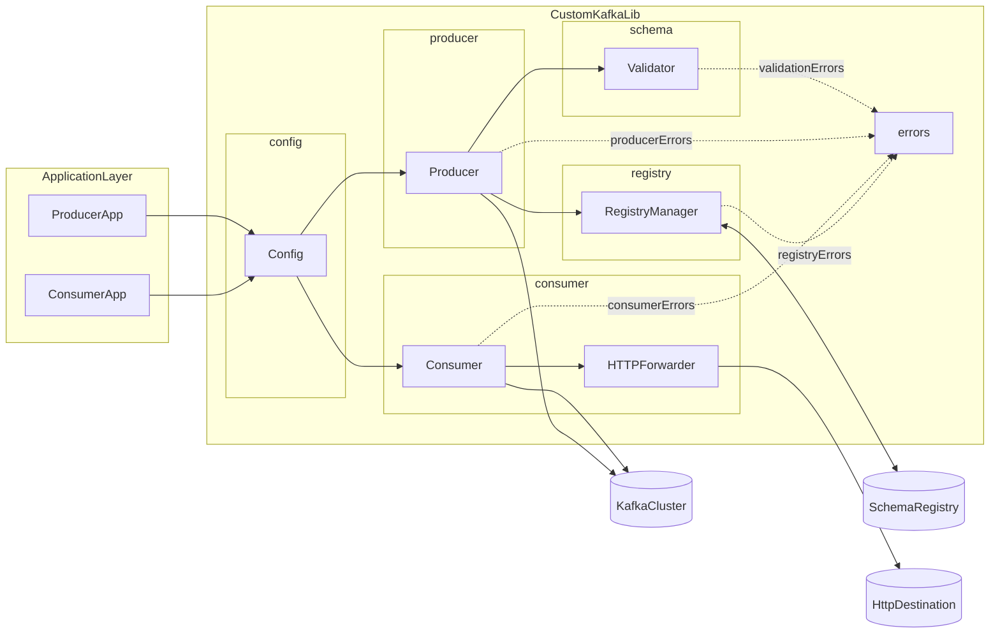
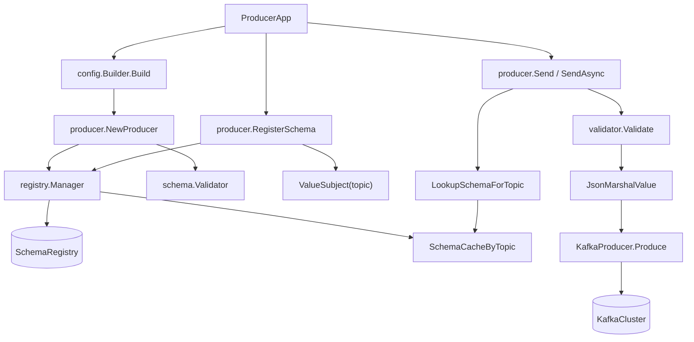
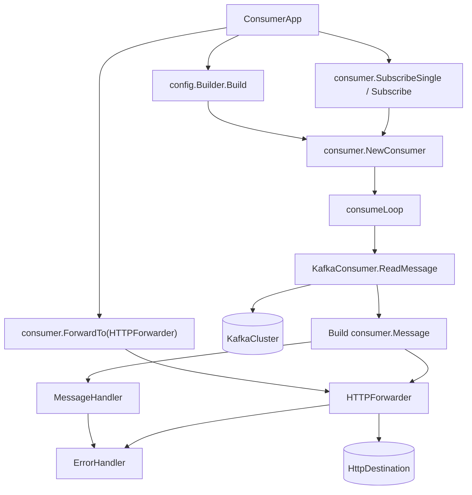

## Architecture Overview

This document describes the architecture of the Go implementation of the custom Kafka library.
It focuses on how the library enforces schema-first Kafka usage, standardizes producer/consumer
integration, and provides a smooth developer experience for application teams.

### Goals

- **Standardization**: Provide a single, opinionated way for teams to:
  - Configure Kafka clients.
  - Register and validate schemas (Avro or JSON Schema) via Schema Registry.
  - Produce and consume messages.
- **Schema-first**: Only data that conforms to a registered schema should be produced.
- **DX-focused**: Application teams should not need deep Kafka or Schema Registry knowledge.
- **Extensibility**: New schema types, sinks, or integration patterns should be addable without breaking existing users.

---

## Package Architecture

The Go library is structured into small, focused packages:

- `config`: Fluent builder for producer and consumer configuration.
- `schema`: Schema validation abstraction and concrete validators for Avro and JSON.
- `registry`: Client for Confluent Schema Registry (register, fetch, compatibility).
- `producer`: High-level Kafka producer that enforces schema validation.
- `consumer`: High-level Kafka consumer with handler hooks and HTTP forwarding.
- `errors`: Typed errors for producer, consumer, schema, and registry failures.
- `examples`: Example applications showing intended usage patterns.

### High-Level Component Diagram

**Key ideas:**

- Application code interacts only with a small surface area:
  - `config` for configuration.
  - `producer` to send messages.
  - `consumer` to receive and optionally forward messages.
- Schema Registry and validation details are hidden behind `registry` and `schema`.
- HTTP forwarding is an optional capability layered on top of the consumer.

---

## Producer-Side Architecture

### Responsibilities

The `producer` package:

- Creates a Kafka producer (`confluent-kafka-go`) with sensible defaults:
  - Idempotence enabled.
  - Retries and backoff configured.
- Integrates with `registry.Manager` to:
  - Register schemas per topic as `{topic}-value` subjects.
  - Cache schema strings per topic in-memory.
- Integrates with `schema.Validator` to:
  - Validate all messages against the registered schema **before** producing.
- Exposes high-level APIs:
  - `RegisterSchema(topic, schemaStr)`
  - `Send(...)`, `SendWithHeaders(...)`, `SendAsync(...)`

### Producer Flow

**Consequences:**

- No message can be produced without:
  - A registered schema for that topic.
  - Passing validation against that schema.
- Producer configuration and behavior are consistent across teams.

---

## Consumer-Side Architecture

### Responsibilities

The `consumer` package:

- Wraps `confluent-kafka-go` consumer with:
  - Subscribe helpers (`Subscribe`, `SubscribeSingle`).
  - Start helpers (`Start`, `StartAsync`).
  - A higher level `Message` struct for application handlers.
  - Optional automatic HTTP forwarding via `HTTPForwarder`.
- Keeps error handling pluggable via:
  - `ErrorHandler`
  - `FatalErrorHandler`

### Consumer Flow

**Notes:**

- The consumer does not currently re-validate messages against a schema; it assumes the producer side enforced schema correctness.
- Applications can:
  - Provide a `MessageHandler` for custom processing, and/or
  - Rely on `HTTPForwarder` to pipe messages to external systems.

---

## Schema & Registry Architecture

### Schema Abstraction

The `schema` package defines a `Validator` interface:

- `Validate(data, schemaStr) error`
- `IsValid(data, schemaStr) ValidationResult`

Concrete implementations:

- `AvroValidator` using `goavro`.
- `JSONValidator` using `jsonschema/v5`.

The `ValidatorFactory` chooses the correct validator based on `config.SchemaType` (`AVRO` or `JSON`).

### Registry Manager

The `registry.Manager`:

- Encapsulates HTTP calls to Schema Registry:
  - `RegisterSchema(subject, schemaStr)`
  - `GetLatestSchema(subject)`
  - `GetSchemaByVersion(subject, version)`
  - `GetSchemaByID(id)`
  - `GetAllVersions(subject)`
  - `CheckCompatibility(subject, schemaStr)`
- Maintains an in-memory cache of subject → schema string to reduce network calls.

This separation allows:

- Future extension of schema backends (e.g., different registries).
- Use of registry operations (e.g., compatibility checks) independently from producer/consumer.

---

## Error Handling Architecture

The `errors` package standardizes error types:

- `ProducerError`: production failures (configuration, broker errors, delivery failures).
- `ConsumerError`: consumption failures (subscribe, read, commit).
- `SchemaValidationError`: data not conforming to schema.
- `SchemaRegistryError`: failures talking to Schema Registry.

On the consumer side:

- `ErrorHandler` is called when a handler or forwarder returns an error.
- `FatalErrorHandler` can be used to surface unrecoverable problems.

This enables:

- Centralized logging/metrics for library users.
- Different strategies for transient vs fatal failures.

---

## Extensibility Considerations

- **New schema types**: Add a new `Validator` implementation and extend `ValidatorFactory`.
- **New sinks**: Add new forwarders similar to `HTTPForwarder` without touching consumer internals.
- **Additional Kafka features**: Expose new configuration knobs via `config.Builder` and propagate into `producer`/`consumer` without breaking call sites.

